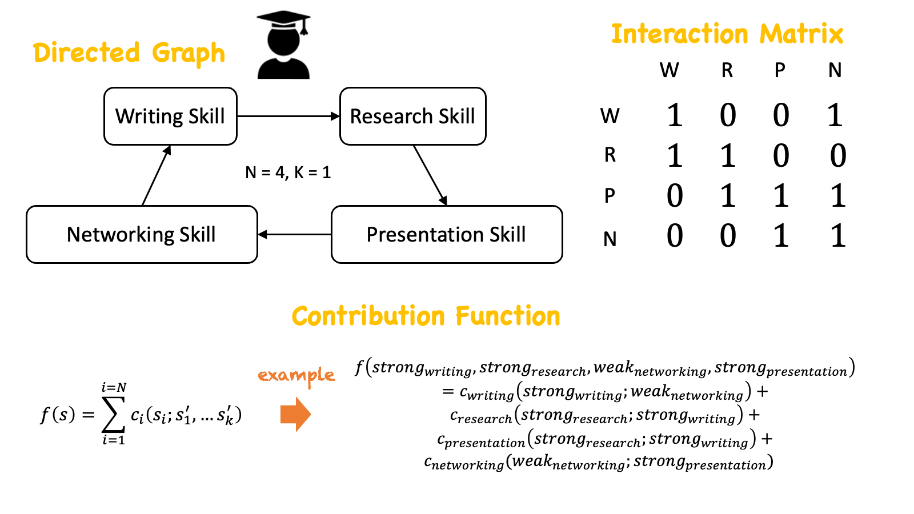

  
The NK model is a mathematical framework that assesses the performance of a system based on its constituent components. In this model, the system is composed of \(N\) components, each of which contributes to its overall functionality. Taking the example of a PhD student, these componentes might include research skill, writing skill, presentation skill, and network skill. Each component can exist in various states such as being strong or weak. 


  
What distinguishes the NK model is that the impact of each component on the system's performance is not solely determined by its own state; rather it also depends on the states of other components with whihc its intereacts. For example, the effectiveness of networking skill in aiding a PhD student's progress might be influenced by factors such as the presentation skills. Likewise, the impact of presentation skill on a a student's performance could be contingent on research skill; research skill's contribution to the performance can be affected by writing skill; and writing skill's contribution to the performance can be affected by network skill. This can be represented through either a directed graph or an interaction matrix. In the directed graph representation, each component becomes a node and directed edge indicates the dependency of each component's contribution to the performance.  


  
Each component in the system has its own contribution function, which specifies how the component's state affects the system's fitness, taking into account interactions with other components. For example, the input variables of the contribution function of research skills can be both research skill and writing skill as writing skill affects the contribution of research skill on PhD's performance. \(K\) in the NK model indicates the number of other components that affects the contribution of each component to the performance. For instnace, in our case, \(K=1\) as only one other component affects each component's contribution.  


  
When \(K\) is set to 0, components operate independently of each other, while maximal  \(K = N-1\) indicates that each component's contribution depends on every other component. Adjusting \(K\) allows for tuning the complexity of the mapping between component states and system fitness. If we represent this system as 3d, where vertical axis indicates the fitness (performance) and horizontal space indicates the states, this landscapes become more complex as \(K\) increases. Landscape with high complexity is characterized by ruggedness with numerous local peaks, the influence of component interactions on system performance becomes more pronounced. 


### Reference

* Csaszar, F. A. (2018). A note on how NK landscapes work. Journal of Organization Design, 7(1), 15.

